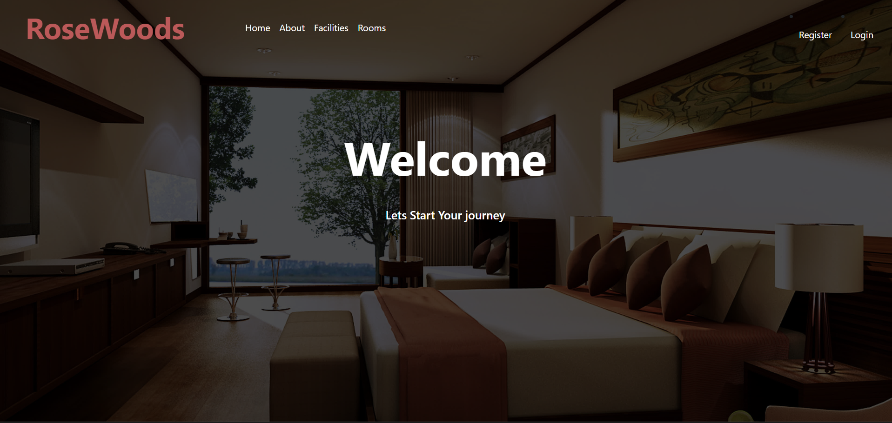
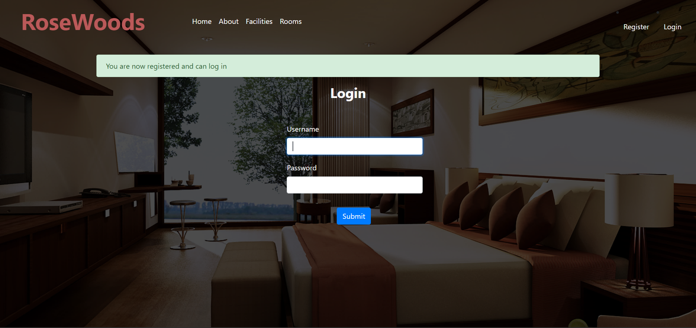
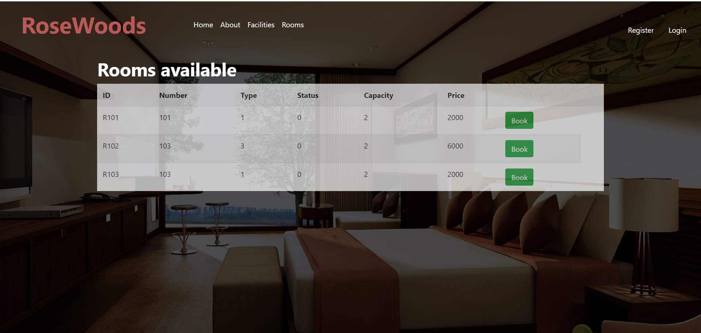

# Hotel Management System

This Hotel Management System is designed to streamline hotel operations, including room booking, amenity reservations, and bill generation. The system utilizes HTML/CSS for the front-end, Flask for the backend, Flask-MySQL for database connectivity, and MySQL Server for data storage.

## Features

- **Room Booking**: Allows users to browse available rooms, select dates, and book rooms.
- **Amenity Reservations**: Enables users to book amenities such as spa services, gym access, etc.
- **Bill Generation**: Generates PDF bills for bookings and amenity usage.
- **Database Connectivity**: Utilizes Flask-MySQL for seamless interaction with the MySQL Server.
- **Triggers and Cursors**: Implements MySQL triggers and cursors for data manipulation and automated actions.

## Technologies Used

- **Frontend**:
  - HTML/CSS: Provides the user interface for interacting with the system.
- **Backend**:
  - Flask: Manages routing, business logic, and communication with the database.
  - Flask-MySQL: Connects Flask with MySQL for database operations.
- **Database**:
  - MySQL Server: Stores data related to rooms, bookings, amenities, and bills.
  - Triggers and Cursors: Utilized for data manipulation and automation within the database.

## File Structure

The project files are organized as follows:

- `app.py`: Flask application file managing routes, database connections, and business logic.
- `templates/`: Directory containing HTML templates for different pages.
- `static/`: Folder housing static files like CSS stylesheets and client-side scripts.
- `database.sql/`: Scripts for creating tables, triggers, and cursors in the MySQL database.

## Setup and Usage

To run the Hotel Management System locally:

1. Install MySQL Server and create a new database for the system.
2. Execute the scripts in `database.sql/` to set up the required tables, triggers, and cursors.
3. Clone the repository:

    ```bash
    [git clone https://github.com/your-username/hotel-management.git](https://github.com/harish-123445/HotelHub-Pro.git)
    ```

4. Install the necessary dependencies:

    ```bash
    pip install flask flask-mysql
    ```

5. Configure the database connection details in `app.py`.
6. Start the Flask application:

    ```bash
    python app.py
    ```

7. Open your browser and visit `http://localhost:5000` to access the Hotel Management System.

 ##Output images
 
 
 
 
## Acknowledgments

- The project leverages Flask, Flask-MySQL, and MySQL Server for seamless hotel management operations.

Feel free to explore the system, contribute, or utilize the codebase for your hotel management needs!
